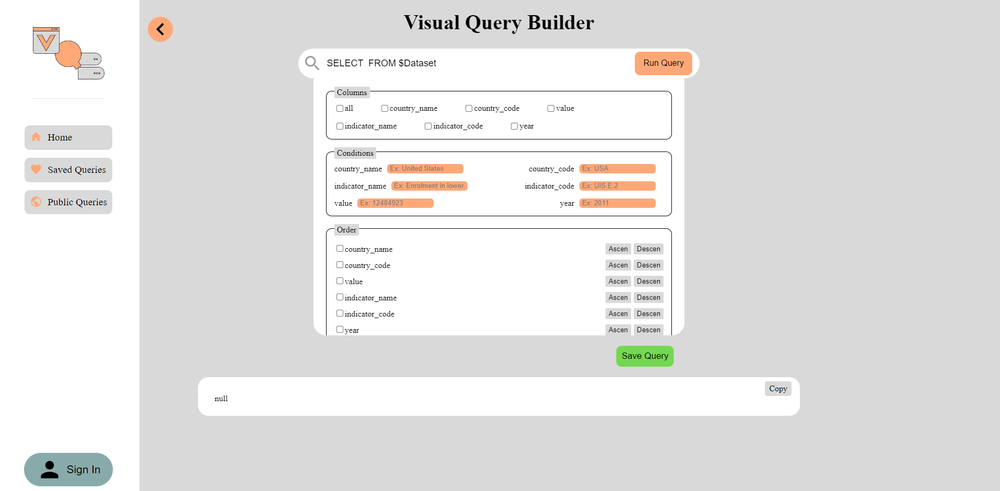

# Frontend

This project was generated with create-next-app.

## Project Structure

$PROJECT_ROOT
| # all the files related to the frontend are in this folder
|--> src
| # Pages files
|----> pages
| # components and funcionality
|----> components
| # styles
|----> styles
| # redux files
|----> redux
|
| # images and other static files are in this folder
|--> public

## Install and run

```bash
npm install
npm run dev
```

## Images

### Principal view


